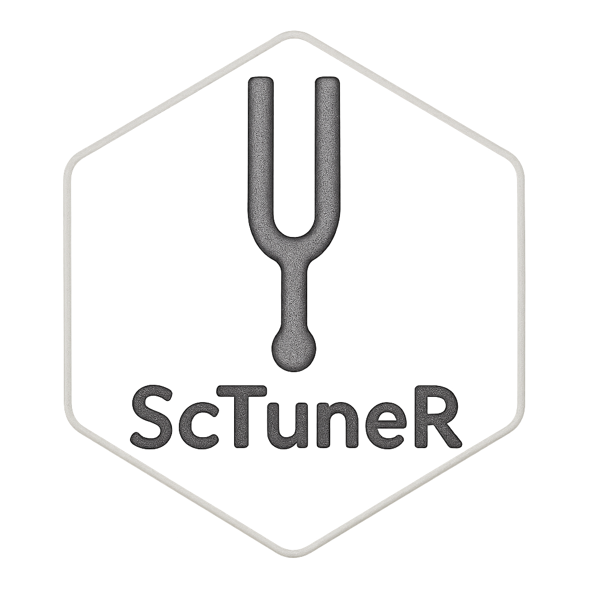

<p align="center">
  
</p>

# ScTuneR

**ScTuneR** is a flexible and streamlined R pipeline for preprocessing and tuning parameters in single-cell RNA-seq analysis using Seurat. It supports optional subcluster analysis, Harmony-based integration, and automated dimensionality reduction and clustering evaluation over user-defined PC and resolution ranges.

## 📦 Features

- Accepts a single Seurat object (for subcluster analysis) or named lists of Seurat objects (for merge or integration)
- Optional subcluster analysis
- SCTransform normalization
- Merging, PCA, and elbow plot generation
- Harmony integration (optional)
- Automated exploration of PC and clustering resolution combinations
- UMAP visualizations for each combination
- Timestamped output folder for safe reruns
 
## 🚀 Quick Start

### 🔧 Requirements

Install required R packages:

```r
install.packages(c("tidyverse", "optparse"))
install.packages("magrittr")
install.packages("patchwork")
remotes::install_github("satijalab/seurat")  # if not installed
```

### 🖥️ Usage

```{bash}
Rscript ScTuneR.R \
  --seurat_obj path/to/your_seurat_obj.rds \
  --output_dir path/to/output_directory \
  --sub_analysis TRUE \
  --splitby orig.ident \
  --integration TRUE \
  --pc_range "30,40,50" \
  --res_range "0.2,0.4,0.6"
```

### 📝 Parameters

- `--seurat_obj`  
  **(Required)** Path to either a .rds or .RData file containing a Seurat object or a named list of Seurat objects.

- `--output_dir`  
  Directory where output files will be saved. Default is `./`.

- `--sub_analysis`  
  Whether to split object by metadata (e.g., orig.ident). Default is TRUE.

- `--splitby`  
  Metadata column to split by (used only if `sub_analysis = TRUE`). Default is `orig.ident`.

- `--integration`  
  Whether to perform Harmony-based integration. Default is TRUE.

- `--pc_range`  
  Comma-separated list of principal components to explore. Default is `30,40,50`.

- `--res_range`  
  Comma-separated list of resolutions to explore. Default is `0.2,0.4,0.6`.
  

## 📂 Output

A timestamped subdirectory is created under the specified output directory, containing:
- SCTed_seu_obj_ls.rds: Normalized Seurat objects
- merged_seu_obj.rds: Merged (but not integrated) object
- integrated_seu_obj.rds: Harmony-integrated object (if `--integration = TRUE`)
- merged_PCA.png: Elbow plot
- UMAP_PCres.png: UMAP plots across all PC-res combinations


## 📌 Notes

- The script automatically handles .rds and .RData formats.
- Sub-analysis is helpful when starting with a single merged object.
- A named list of Seurat objects is expected for standard analysis (`--sub_analysis FALSE`).
